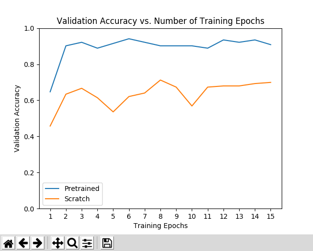
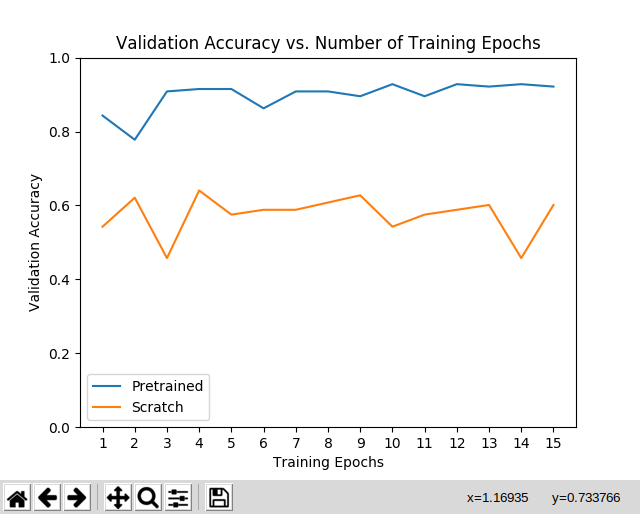
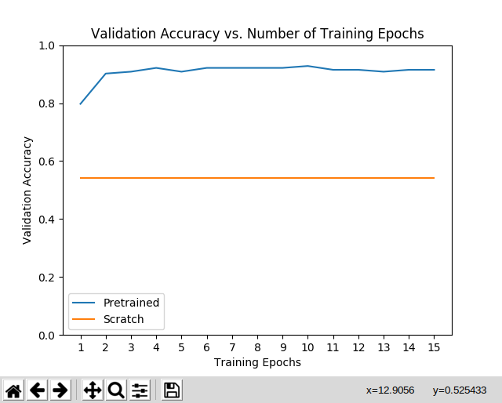

Triplet loss for facial recognition.

# First attempt using Google Colab
It was quite hard and messy to make Python code work using git clone etc.
In fact I had many problems 
* in passing args to executed python scripts
* in unzipping or downloading the dataset
* in coding by the way, i hate jupyter notebook
* in managing to code in all that mess

So i'll try to do it an other and more simple way

# Source of the new code (inceptionV3 and resnet!)
[pytorch.org/tutorials](https://pytorch.org/tutorials/beginner/finetuning_torchvision_models_tutorial.html)

My attempt to have better accuracy will be based on this tutorial code, and will be executed locally

This code uses the default ImageFolder dataset class:

[ImageFolderDocumentation](https://pytorch.org/docs/stable/torchvision/datasets.html#torchvision.datasets.ImageFolder)

In finetuning, we start with a pretrained model and update all of the model’s parameters for our new task, in essence retraining the whole model. In feature extraction, we start with a pretrained model and only update the final layer weights from which we derive predictions.

--> So we'll use feature extraction because we don't want to train model

to install requirements:

alias py3=/usr/bin/python3

py3 -m pip install -r requirements.txt

# Trainings using hymenoptera_data datataset

## First test using resnet model:



## Second test using InceptionV3 model



We can see that the accuracy is slightly better for inception at the beginning of training
But for all the rest, it's quite the same

## Third test using squeezenet model



This one seems to be very stable, but has quite the same accuracy as the two others
I would put a bit more trust in this one personally


## Trainings using triplet face dataset:
The number of classes in our dataset:  ls dataset/test/ -A | wc -l
It returned 17


# Triplet Face

The repository contains code for the application of triplet loss training to the
task of facial recognition. This code has been produced for a lecture and is not
going to be maintained in any sort.


## Architecture

The proposed architecture is pretty simple and does not implement state of the
art performances. The chosen architecture is a fine tuning example of the
resnet18 CNN model. The model includes the freezed CNN part of resnet, and its
FC part has been replaced to be trained to output latent variables for the
facial image input.

The dataset needs to be formatted in the following form:
```
dataset/
| test/
| | 0/
| | | 00563.png
| | | 01567.png
| | | ...
| | 1/
| | | 00011.png
| | | 00153.png
| | | ...
| | ...
| train/
| | 0/
| | | 00001.png
| | | 00002.png
| | | ...
| | 1/
| | | 00001.png
| | | 00002.png
| | | ...
| | ...
| labels.csv        # id;label
```

## Install

Install all dependencies ( pip command may need sudo ):
```bash
cd TripletFace/
pip3 install -r requirements.txt
```

## Usage

For training:
```bash
usage: train.py [-h] -s DATASET_PATH -m MODEL_PATH [-i INPUT_SIZE]
                [-z LATENT_SIZE] [-b BATCH_SIZE] [-e EPOCHS]
                [-l LEARNING_RATE] [-w N_WORKERS] [-r N_SAMPLES]

optional arguments:
  -h, --help            show this help message and exit
  -s DATASET_PATH, --dataset_path DATASET_PATH
  -m MODEL_PATH, --model_path MODEL_PATH
  -i INPUT_SIZE, --input_size INPUT_SIZE
  -z LATENT_SIZE, --latent_size LATENT_SIZE
  -b BATCH_SIZE, --batch_size BATCH_SIZE
  -e EPOCHS, --epochs EPOCHS
  -l LEARNING_RATE, --learning_rate LEARNING_RATE
  -w N_WORKERS, --n_workers N_WORKERS
  -r N_SAMPLES, --n_samples N_SAMPLES
```

## References

* Resnet Paper: [Arxiv](https://arxiv.org/pdf/1512.03385.pdf)
* Triplet Loss Paper: [Arxiv](https://arxiv.org/pdf/1503.03832.pdf)
* TripletTorch Helper Module: [Github](https://github.com/TowardHumanizedInteraction/TripletTorch)

## Todo ( For the students )

**Deadline Decembre 14th 2019 at 12am**

The students are asked to complete the following tasks:
* Fork the Project
* Improve the model by playing with Hyperparameters and by changing the Architecture ( may not use resnet )
* JIT compile the model ( see [Documentation](https://pytorch.org/docs/stable/jit.html#torch.jit.trace) )
* Add script to generate Centroids and Thesholds using few face images from one person
* Generate those for each of the student included in the dataset
* Add inference script in order to use the final model
* Change README.md in order to include the student choices explained and a table containing the Centroids and Thesholds for each student of the dataset with a vizualisation ( See the one above )
* Send the github link by mail
